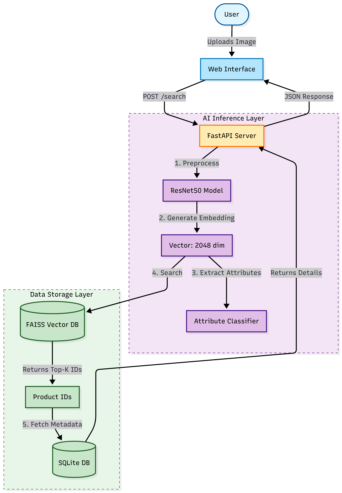

# 👓 Visual Similarity Search for Eyewear

An AI-powered visual search engine that allows users to find eyewear by uploading an image. The system uses Deep Learning to understand visual style and retrieves similar products from a catalog.

## 🚀 Features
- **Visual Search:** Upload an image to find similar glasses.
- **Filters:** Narrow down results by Price, Brand, Material, Color, and Frame Style.
- **AI Attributes:** Automatically detects attributes like "Aviator" or "Black" using a classifier.
- **Feedback Loop:** Tracks "Relevant" clicks to boost popular products.
- **Multi-Modal:** Supports text modifiers (e.g., upload black glasses + text "but in gold").

## 🏗️ System Architecture

The system follows a clean separation between the **AI Inference Layer** and **Data Storage Layer**, ensuring modularity and scalability.



### Architecture Overview

**1. AI Inference Layer:**
- **Feature Extraction:** Uses **ResNet50** (pre-trained on ImageNet) to extract 2048-dimensional embeddings.
- **Attribute Recognition:** Classifies visual traits independently of the database.
- **Preprocessing:** Handles resizing, normalization, and smart cropping.

**2. Data Storage Layer:**
- **Vector Database (FAISS):** Stores high-dimensional embeddings for sub-millisecond similarity search.
- **Structured Database (SQLite):** Stores product metadata (Price, Brand, Material) for filtering.

### Data Flow
1. **Ingestion Pipeline:**
   ```
   Catalog Images → Preprocessing → ResNet50 → Embeddings → FAISS + SQLite
   ```
2. **Search Pipeline:**
   ```
   User Image → Preprocessing → ResNet50 → Embedding → FAISS Search → Filter → Rank → Results
   ```
3. **Feedback Loop:**
   ```
   User Clicks → Feedback Storage → Relevance Update → Improved Rankings
   ```

## 🛠️ Tech Stack
- **Backend:** FastAPI (Python)
- **AI/ML:** PyTorch, torchvision, FAISS
- **Database:** SQLite (Metadata), FAISS (Vectors)
- **Frontend:** HTML/CSS/JS

## 🧠 Design Choices
- **ResNet50:** Chosen for its balance between accuracy and speed. We removed the final classification layer to extract a **2048-dimensional feature vector** that mathematically represents the visual style.
- **Cosine Similarity:** Used instead of Euclidean distance because we care about the *angle* (style/shape) of the feature vectors rather than their magnitude.
- **Hybrid Search:** Combines vector similarity (Nearest Neighbors) with hard SQL filters (WHERE clauses) to ensure results are both visually similar and relevant to user constraints.

## 🏃‍♂️ How to Run

1. **Install Dependencies:**
   ```bash
   pip install -r requirements.txt
   ```

2. **Download Data:**
   ```bash
   python download_images.py
   ```

3. **Build Database (Ingestion):**
   ```bash
   python reset_and_ingest.py
   ```

4. **Start Server:**
   ```bash
   uvicorn app.main:app --reload
   ```

5. **Open:** Go to [http://localhost:8000](http://localhost:8000)
